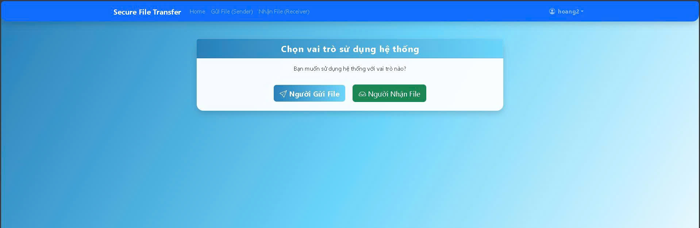
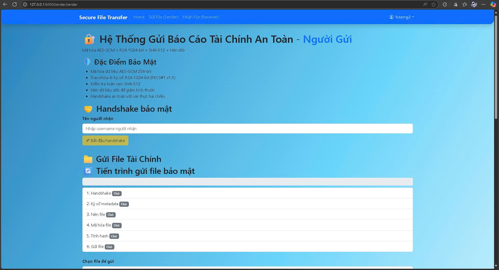
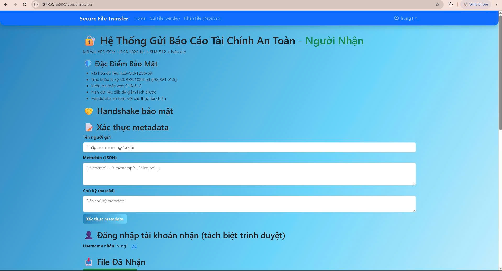

# 🔐 Hệ Thống Gửi Báo Cáo Tài Chính An Toàn

## Mô Tả Đề Tài 4

Hệ thống gửi file `finance.txt` chứa dữ liệu ngân hàng với nén dữ liệu và bảo mật đầy đủ.

### 🛡️ Tính Năng Bảo Mật

- **Mã hóa**: AES-GCM 256-bit
- **Trao khóa & ký số**: RSA 1024-bit (PKCS#1 v1.5 + SHA-512)  
- **Kiểm tra tính toàn vẹn**: SHA-512
- **Nén dữ liệu**: zlib để giảm kích thước

### 📷 Sơ đồ hoạt động hệ thống


### 🔄 Luồng Xử Lý

#### 1. Handshake
- Người gửi gửi "Hello!"
- Người nhận trả lời "Ready!"

#### 2. Xác thực & Trao khóa
- Người gửi ký metadata (tên file + timestamp + loại file) bằng RSA/SHA-512
- Người gửi mã hóa SessionKey bằng RSA 1024-bit (PKCS#1 v1.5) và gửi

#### 3. Mã hóa & Kiểm tra toàn vẹn
- Nén file bằng zlib
- Tạo nonce ngẫu nhiên
- Mã hóa file nén bằng AES-GCM → tạo ciphertext và tag
- Tính hash: SHA-512(nonce || ciphertext || tag)
- Gói tin gửi:
```json
{
  "nonce": "<Base64>",
  "cipher": "<Base64>", 
  "tag": "<Base64>",
  "hash": "<hex>",
  "sig": "<Signature>"
}
```
#### 4. Phía Người nhận
- Kiểm tra hash, chữ ký, và tag
- **Nếu hợp lệ**: Giải mã → giải nén → lưu file → gửi ACK
- **Nếu không hợp lệ**: Từ chối → gửi NACK (lỗi integrity)


### 📷 giao diện hệ thống


### 📷 giao diện phía người gửi và 




## 🚀 Cài Đặt & Chạy

### 1. Cài đặt dependencies
```bash
python install_deps.py
```

### 2. Chạy ứng dụng
```bash
python run.py
```

### 3. Mở browser
```
http://localhost:5000
```

## 📋 Hướng Dẫn Sử Dụng

### Bước 1: Khởi chạy WebSocket Server
- Nhấn "Khởi Chạy Server" để bật WebSocket server tại `ws://localhost:8765`

### Bước 2: Tạo/Upload file tài chính
- **Tạo file test**: Nhấn "Tạo File Test" để tạo `finance.txt` mẫu
- **Upload file**: Chọn file từ máy tính (.txt, .csv, .json, .pdf)

### Bước 3: Gửi file an toàn
- Nhấn "Gửi File An Toàn" để thực hiện toàn bộ quy trình mã hóa

### Bước 4: Kiểm tra file đã nhận
- File được giải mã sẽ xuất hiện trong danh sách "File Đã Nhận"
- Có thể tải xuống để kiểm tra

## 🏗️ Cấu Trúc Project

```
my_web_project/
├── app/
│   ├── __init__.py              # Flask app factory
│   ├── routes/
│   │   ├── __init__.py
│   │   └── main.py              # Flask routes
│   ├── services/
│   │   ├── crypto_service.py    # Dịch vụ mã hóa
│   │   ├── websocket_server.py  # WebSocket server  
│   │   └── websocket_client.py  # WebSocket client
│   └── templates/
│       └── index.html           # Giao diện web
├── uploads/                     # File upload
├── received_files/              # File đã nhận
├── test_files/                  # File test
├── config.py                    # Cấu hình Flask
├── requirements.txt             # Dependencies
├── install_deps.py              # Script cài đặt
├── run.py                       # Entry point
└── README.md                    # File này
```

## 🔍 Các File Quan Trọng

### crypto_service.py
- `CryptoService`: Các hàm mã hóa cơ bản (AES, RSA, SHA-512)
- `SecureFileTransfer`: Logic truyền file an toàn theo đề tài 4

### websocket_server.py  
- `SecureFileServer`: WebSocket server xử lý nhận file
- Xử lý handshake, trao khóa, nhận file đã mã hóa

### websocket_client.py
- `SecureFileClient`: WebSocket client gửi file  
- Thực hiện đầy đủ quy trình gửi file an toàn

## 🧪 Test

Hệ thống tự động tạo file `finance.txt` mẫu với nội dung:
- Thông tin tài khoản ngân hàng
- Số dư và giao dịch  
- Dữ liệu nhạy cảm cần bảo mật

## ⚡ Lưu Ý Kỹ Thuật

- **WebSocket Server**: Chạy trên cổng 8765
- **Flask Web**: Chạy trên cổng 5000
- **RSA Key Size**: 1024-bit (theo yêu cầu đề tài)
- **AES Mode**: GCM với 256-bit key
- **Hash Algorithm**: SHA-512
- **Compression**: zlib level mặc định

## 🐛 Troubleshooting

### Lỗi import Crypto
```bash
pip uninstall crypto pycrypto
pip install pycryptodome
```

### Lỗi WebSocket 
- Kiểm tra port 8765 có bị chiếm không
- Restart server nếu cần

### File không gửi được
- Kiểm tra server đã khởi chạy chưa  
- Kiểm tra đường dẫn file có đúng không

## 👨‍💻 Tác Giả

Hệ thống được xây dựng theo đề tài 4 - Gửi báo cáo tài chính có nén dữ liệu với đầy đủ tính năng bảo mật theo yêu cầu.

## 1. Set Up the Environment
### Step 1: Create a Virtual Environment
```bash
python -m venv venv
```

### Step 2: Activate the Virtual Environment
```bash
source venv/bin/activate  # or venv\Scripts\activate on Windows
```

### Step 3: Install Required Packages
```bash
pip install -r requirements.txt
```

## 2. Configure Environment Variables
```bash
SECRET_KEY=supersecretkey
```

## 3. Run project
```bash
python run.py
```
Then open your browser and navigate to:
```
http://127.0.0.1:5000/
```
# Project Structure
my_web_project/
├── app/
│   ├── routes/
│   ├── models/
│   ├── services/
│   ├── templates/
│   └── static/
├── tests/
├── .env
├── .gitignore
├── config.py
├── requirements.txt
├── run.py
└── README.md

